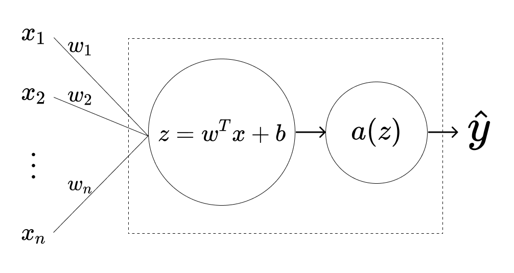

# Why program a single neuron?

# The anatomy of a computational neuron

Before we dive into coding the neuron itself, we should first understand its underlying structure and components. The image below summarizes the entire structure, but we will go through each element one by one.

<ImageCard>

</ImageCard>

## Inputs

A column vector $\vec{x} \in \mathbb{R}^{n}$, meaning that it has $n$ rows, or $n$ different real-valued attributes. In the example we will code below, we will deal with images. Images are nothing more than a $n \times m \times 3$ matrix, where $n$ represents the width of the image in pixels, $m$ represents its height (also in pixels), and $3$ stands in a third axis where the amount of red, green and blue per pixel is defined. There values are in the range $[0, 255]$, meaning that our $\vec{x}$ can be described as belonging to the $\mathbb{R}^{n \times m \times 3}$ space.

## Value function

The second part of a neuron is the computation of a linear combination of the $x_i$ input values, each weighted by a certain weight $w_i$ and adjusted by a real-valued bias $b$.

## Activation function

Once we have the value of the linear combination, we feed this value to an activation function, which will map this value to another real-valued function and then use it to predict the output of our neuron. Naturally, there are several ways we can model the prediction. We will go back to this later in this article and discuss different examples of how different activation functions are used in different contexts.

Some options are (should be non linear):

- Sigmoid function: can be used for the output
- tanh function: better for hidden layers
- ReLU: learns faster than sigmoid and tanh
- Leaky ReLU: better than ReLU

### Pros and cons

Sigmoid:

- Do not use except for output layer

Tanh:

- Superior to sigmoid

ReLU:

- Very popular

Rules of thumb:

- If output is 0 or 1, sigmoid is better
- For other units, ReLU is increasingly the default choice

## Prediction

Last but not least, we should do something with the output of the activation function. In a single-neuron network, this final step gives us the prediction. The range of the neuron's output should, naturally, be the same as the actual labels we have for the data. For example, if our labels indicate membership to a certain class or lack thereof, they can be transformed into a binary value of $1$ to indicate membership and $0$ to indicate no membership to the class. We should then make sure that the transformation of the activation function leads to the same range as the real labels.

<CodeHighlighter
  code={`
(function someDemo() {
  var test = "Hello World!";
  console.log(test);
})();\n
const test = "This is a somwhat longer line which should not break into the next line";
return () => <App />;
`}
  language="python"
/>

$a + b = c$ and continue writing! The next paragraph is a whole equation

$$
\int_{-\infty}^{\infty} p(x) = 1
$$

And the equation can also be inline: $\int_{-\infty}^{\infty} p(x) = 1$

$$
\begin{bmatrix}
1 & 2 & 3\\
a & b & c
\end{bmatrix}
$$

Reminder: The general methodology to build a Neural Network is to:

1. Define the neural network structure ( # of input units, # of hidden units, etc).
2. Initialize the model's parameters
3. Loop:
   - Implement forward propagation
   - Compute loss
   - Implement backward propagation to get the gradients
   - Update parameters (gradient descent)
