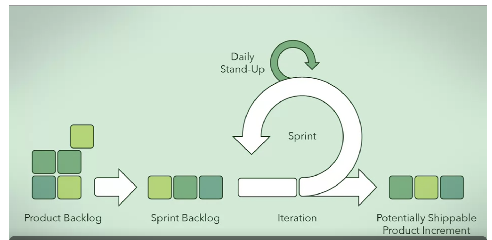

Object oriented modelling involves the practice of representing key concepts through objects in the software.

Keeps code organized (keeps related details and specific functions bundled in distinct, easy to find places),
flexible (since we can change details without affecting other parts of the code) and reusable (we can use the same
object in many places of our code).

Objects have **attributes** and **behaviors**.

## Why thinking about design

The Standish Group - White papers - Chaos report

According to the survey above, the most common causes for project failures are related to requirement and design.
Take your time to consider requirement elicitation.

Software requirement -> Conceptual Design -> Technical Mockup

Once you make assumptions about the system and move forward with those assumptions, it is hard to change them
later down the road.

During the design phase, we need to think like an architect in terms of the structure and the behavior of our
software.

Eliciting requirements: what does the client want? Which clarifications are needed? Ask revealing follow up
questions.

Design task: take requirements and design a solution.

Conceptual mockups: provide the initial thoughts on how the requirements will be satisfied. Focus on major
components and connections. Each component has a responsibility. Finish this before moving on to the technical
designs.

Technical design: start defining the specific details of each component. Starts with breaking down larger
components into smaller components.

Technical diagrams: express how to address specific technical issues. It allows to identify issues and
infeasible aspects of the conceptual designs, so that we address these before actually jumping into the
development.

Conceptual design: user interfaces, mockups.

Components: collections of functions, classes, or other components. These pieces represent a much simpler problem
that the developers can individually implement.
